# Spring Boot REST API

Một REST API được xây dựng bằng Spring Boot với các tính năng xác thực JWT, quản lý người dùng và bảo mật.

## 🛠️ Tech Stack
- Spring Boot 3.x
- Spring Security + OAuth2 Resource Server
- JWT Authentication
- PostgreSQL + JPA/Hibernate
- Maven
- Bean Validation

## 🚀 Tính năng

- **Xác thực JWT**: Hệ thống đăng nhập/đăng ký với JWT tokens
- **Quản lý người dùng**: CRUD operations cho user management
- **Phân quyền**: Hệ thống phân quyền với 2 role: ADMIN và USER
- **Bảo mật**: Spring Security với OAuth2 Resource Server
- **Database**: PostgreSQL với JPA/Hibernate
- **Validation**: Bean validation cho request/response
- **Actuator**: Monitoring và health checks

## 🔐 Hệ thống phân quyền

### Roles
- **ADMIN**: Có toàn quyền truy cập và quản lý
- **USER**: Chỉ có quyền truy cập thông tin cá nhân

### Phân quyền chi tiết

#### Public Endpoints (Không cần authentication)
- `POST /auth/login` - Đăng nhập
- `POST /auth/introspec` - Kiểm tra token
- `POST /users` - Đăng ký user mới

#### User Endpoints (Cần authentication)
- `GET /users?userName=xxx` - Tìm user theo username (ADMIN, USER)
- `GET /users/your-information` - Xem thông tin cá nhân (ADMIN, USER)
- `PUT /users/update` - Cập nhật thông tin cá nhân (ADMIN, USER)

#### Admin Only Endpoints
- `DELETE /users/{id}` - Xóa user (ADMIN)


### Logic phân quyền
- **ADMIN**: Có thể thao tác trên tất cả users
- **USER**: Chỉ có thể thao tác trên thông tin của chính mình

## 📋 Yêu cầu hệ thống

### Phần mềm cần thiết

- **Java 17** hoặc cao hơn
- **Maven 3.6+** hoặc sử dụng Maven Wrapper (đã có sẵn)
- **PostgreSQL 12+**


### Cài đặt Java 17

#### Windows
1. Tải Java 17 từ [Oracle](https://www.oracle.com/java/technologies/downloads/#java17) hoặc [OpenJDK](https://adoptium.net/)
2. Cài đặt và thiết lập biến môi trường:
   ```bash
   set JAVA_HOME=C:\Program Files\Java\jdk-17
   set PATH=%JAVA_HOME%\bin;%PATH%
   ```

#### macOS
```bash
# Sử dụng Homebrew
brew install openjdk@17

# Hoặc tải từ Oracle/Adoptium
```

#### Linux (Ubuntu/Debian)
```bash
sudo apt update
sudo apt install openjdk-17-jdk
```

### Cài đặt PostgreSQL

#### Windows
1. Tải PostgreSQL từ [postgresql.org](https://www.postgresql.org/download/windows/)
2. Cài đặt với default settings
3. Ghi nhớ password cho user `postgres`

#### macOS
```bash
brew install postgresql
brew services start postgresql
```

#### Linux (Ubuntu/Debian)
```bash
sudo apt update
sudo apt install postgresql postgresql-contrib
sudo systemctl start postgresql
sudo systemctl enable postgresql
```

## 🛠️ Cài đặt và chạy ứng dụng

### 1. Clone repository
```bash
git clone https://github.com/VuQuocLong21092003/RestApi.git
cd RestApi
```

### 2. Cấu hình database

#### Tạo database PostgreSQL
```sql
-- Kết nối vào PostgreSQL
psql -U postgres

-- Tạo database
CREATE DATABASE "RestAPI";


-- Sử dụng database vừa tạo (nếu cần)
\c RestAPI;
   
-- Tạo bảng users
CREATE TABLE users (
                      id SERIAL PRIMARY KEY,
                      name VARCHAR(100) NOT NULL,
                      username VARCHAR(50) UNIQUE NOT NULL,
                      password VARCHAR(255) NOT NULL,
                      email VARCHAR(100) UNIQUE NOT NULL,
                      phone VARCHAR(20),
                      avatar VARCHAR(255),
                      role VARCHAR(20) CHECK (role IN ('ADMIN', 'USER')) DEFAULT 'USER',
                      deletion_status VARCHAR(20) CHECK (deletion_status IN ('ACTIVE', 'DELETED')) DEFAULT 'ACTIVE'
);


-- Thêm dữ liệu mẫu
INSERT INTO users (name, username, password, email, phone, avatar, role, deletion_status) VALUES
('Nguyễn Văn An', 'annguyen', 'password123', 'an.nguyen@example.com', '0123456789', 'https://example.com/avatars/an.jpg', 'ADMIN', 'ACTIVE'),
('Trần Thị Bình', 'binhtran', 'pass456', 'binh.tran@example.com', '0987654321', 'https://example.com/avatars/binh.jpg', 'USER', 'ACTIVE'),
('Lê Văn Cường', 'cuongle', 'secure789', 'cuong.le@example.com', '0912345678', 'https://example.com/avatars/cuong.jpg', 'USER', 'ACTIVE'),
('Phạm Thị Duyên', 'duyenpham', 'duyen2023', 'duyen.pham@example.com', '0901234567', 'https://example.com/avatars/duyen.jpg', 'USER', 'DELETED'),
('Hoàng Minh Đức', 'duchoang', 'minhduc321', 'duc.hoang@example.com', '0933333333', 'https://example.com/avatars/duc.jpg', 'ADMIN', 'ACTIVE');

-- Kiểm tra database đã tạo
\l

-- Thoát
\q
```

#### Cấu hình connection (tùy chọn)
Chỉnh sửa file `src/main/resources/application.yml` nếu cần:
```yaml
spring:
   datasource:
      url: jdbc:postgresql://localhost:5432/RestAPI
      username: postgres
      password: 123456 # Thay đổi password nếu cần
      driver-class-name: org.postgresql.Driver
   jpa:
      hibernate:
         ddl-auto: update
      show-sql: true
      properties:
         hibernate:
            dialect: org.hibernate.dialect.PostgreSQLDialect


```

### 3. Build và chạy ứng dụng

#### Sử dụng Maven Wrapper (khuyến nghị)
```bash
# Build project
./mvnw clean install

# Chạy ứng dụng
./mvnw spring-boot:run
```

#### Sử dụng Maven (nếu đã cài đặt)
```bash
# Build project
mvn clean install

# Chạy ứng dụng
mvn spring-boot:run
```

#### Chạy JAR file
```bash
# Build và tạo JAR
./mvnw clean package

# Chạy JAR file
java -jar target/RestApi-0.0.1-SNAPSHOT.jar
```


## 📁 Cấu trúc project

```
src/
├── main/
│   ├── java/com/example/RestApi/
│   │   ├── config/           # Cấu hình bảo mật
│   │   ├── controller/       # REST controllers
│   │   ├── dto/             # Data Transfer Objects
│   │   │   ├── request/     # Request DTOs
│   │   │   └── response/    # Response DTOs
│   │   ├── exception/       # Exception handling
│   │   ├── model/           # Entity models
│   │   ├── repository/      # Data access layer
│   │   ├── service/         # Business logic
│   │   │   └── impl/        # Service implementations
│   │   └── untils/          # Utilities và enums
│   └── resources/
│       ├── application.properties
│       └── application.yml
└── test/                    # Unit tests
```

## 🔧 Cấu hình môi trường

### Development
```bash
# Chạy với profile dev
./mvnw spring-boot:run -Dspring-boot.run.profiles=dev
```

### Production
```bash
# Build cho production
./mvnw clean package -Pprod

# Chạy với profile prod
java -jar target/RestApi-0.0.1-SNAPSHOT.jar --spring.profiles.active=prod
```

## 🐛 Troubleshooting

### Lỗi thường gặp

1. **Port 8080 đã được sử dụng**
   ```bash
   # Thay đổi port trong application.yml
   server:
     port: 8081
   ```

2. **Không kết nối được database**
   - Kiểm tra PostgreSQL service đã chạy chưa
   - Kiểm tra thông tin connection trong `application.yml`
   - Kiểm tra firewall

3. **Lỗi Java version**
   ```bash
   # Kiểm tra Java version
   java -version
   
   # Đảm bảo sử dụng Java 17
   export JAVA_HOME=/path/to/java17
   ```

## 📝 API Endpoints  - Test Postman

## 🔐 Authentication Endpoints


### 1. POST /auth/login - Đăng nhập

**Mô tả**: Xác thực người dùng và trả về JWT token

**Request Body**:
```json
{
  "email": "an.nguyen@example.com",
  "password": "password123"
}
```

**Response thành công (200)**:
```json
{
  "status": 200,
  "message": "Login successful",
  "data": {
    "authenticated": true,
    "token": "eyJhbGciOiJIUzI1NiIsInR5cCI6IkpXVCJ9..."
  }
}
```
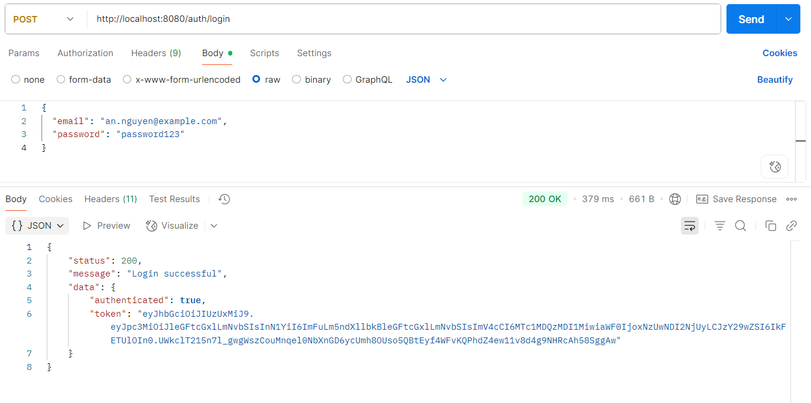

**Response lỗi tài khoản hoặc mật khẩu không đúng (401 - Unauthorized)**:
```json
{
   "type": "/auth/login",
   "title": "Application Exception",
   "status": 401,
   "detail": "Invalid credentials",
   "instance": "/auth/login",
   "errors": [
      "Invalid credentials"
   ]
}
```
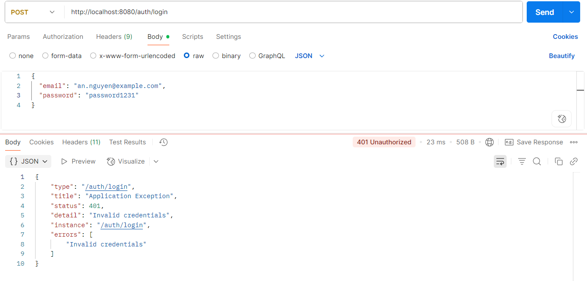
**Response lỗi (400 - Bad Request)**:
```json
{
   "type": "/auth/login",
   "title": "Validation Exception",
   "status": 400,
   "detail": "Validation Failed",
   "instance": "/auth/login",
   "errors": [
      "Email must not be blank"
   ]
}
```
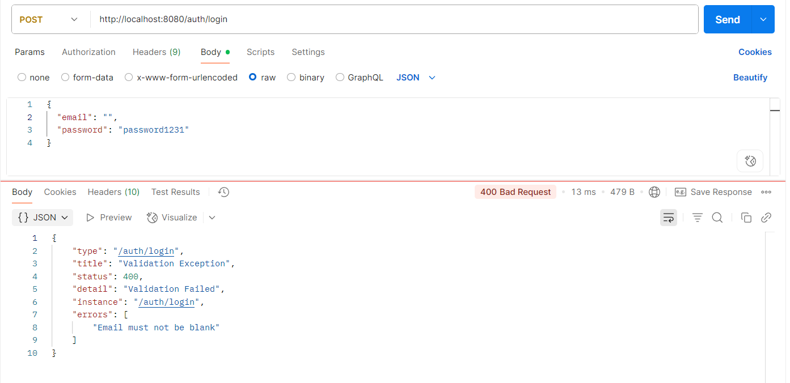
### 2. POST /auth/introspec - Kiểm tra token

**Mô tả**: Xác thực và kiểm tra tính hợp lệ của JWT token

  **Request Body**:
```json
{
  "token": "eyJhbGciOiJIUzI1NiIsInR5cCI6IkpXVCJ9..."
}
```

**Response thành công (200)**:
```json
{
   "status": 200,
   "data": {
      "active": true
   }
}
```
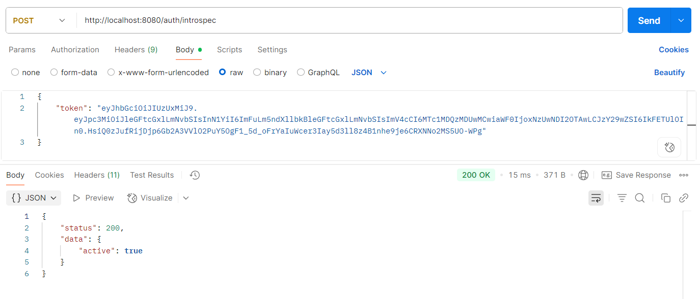
**Response lỗi **:
```json
{
   "status": 200,
   "data": {
      "active": false
   }
}
```

## 👥 User Management Endpoints
### 3. GET /users?userName={username} - Tìm user theo username

**Mô tả**: Lấy thông tin user theo username (cần authentication)

**Headers**:
```
Authorization ->  Auth Type -> Bearer Token -> Token: eyJhbGciOiJIUzI1NiIsInR5cCI6IkpXVCJ9...
```

**Query Parameters**:
- `userName` (required): Tên đăng nhập của user

**Response thành công (200)**:
```json
{
   "status": 200,
   "message": "Get User by user name successfully",
   "data": {
      "name": "Nguyễn Văn An",
      "username": "annguyen",
      "email": "an.nguyen@example.com",
      "phoneNumber": "0123456789",
      "avatar": "https://example.com/avatars/an.jpg"
   }
}
```
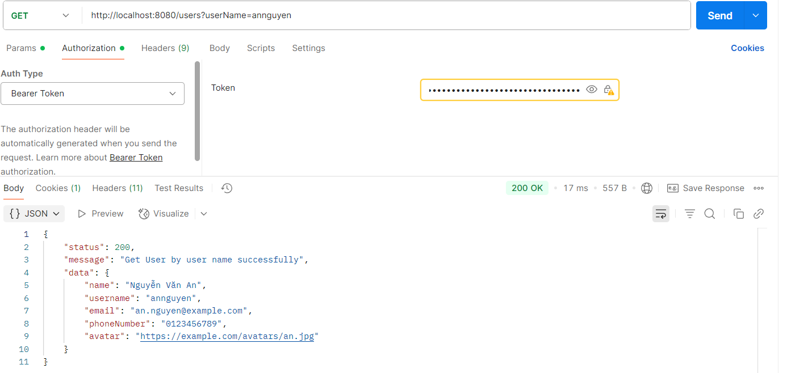
**Response lỗi (404 - User not found)**:
```json
{
   "type": "/users",
   "title": "Application Exception",
   "status": 404,
   "detail": "User not found",
   "instance": "/users",
   "errors": [
      "User not found"
   ]
}
```
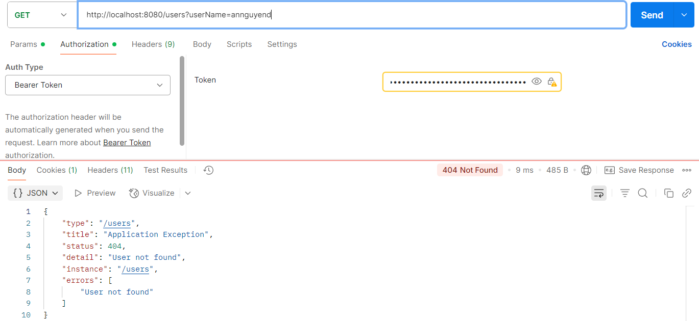
**Response lỗi (401 - Unauthorized)**:
```json
{
  "status": 401
}
```

### 4. GET /users/your-information - Xem thông tin cá nhân
**Mô tả**: Lấy thông tin của user đang đăng nhập

**Headers**:
```
Authorization ->  Auth Type -> Bearer Token -> Token: eyJhbGciOiJIUzI1NiIsInR5cCI6IkpXVCJ9...
```

**Response thành công (200)**:
```json
{
   "status": 200,
   "message": "Get your information successfully",
   "data": {
      "name": "Nguyễn Văn An",
      "username": "annguyen",
      "email": "an.nguyen@example.com",
      "phoneNumber": "0123456789",
      "avatar": "https://example.com/avatars/an.jpg"
   }
}
```
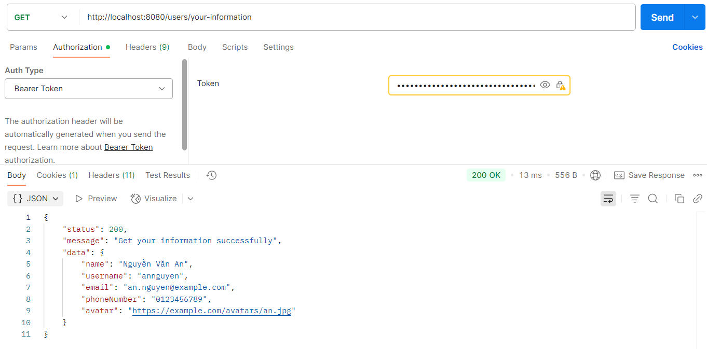
**Response lỗi (401 - Unauthorized)**:
```json
{
  "status": 401
}
```

### 5. POST /users - Tạo user mới (Đăng ký)

**Mô tả**: Tạo tài khoản user mới (public endpoint)

**Request Body**:
```json
{
  "name": "Jane Smith",
  "username": "jane_smith",
  "password": "password123",
  "email": "jane@example.com",
  "phone": "0987654321",
  "avatar": "https://example.com/avatar.jpg"
}
```

**Response thành công (201)**:
```json
{
   "status": 201,
   "message": "User created successfully",
   "data": {
      "name": "Nguyễn Văn A",
      "username": "nguyenvana1233",
      "email": "invalid@gmail1.com",
      "phoneNumber": "0123456789",
      "avatar": "https://example.com/avatar.jpg"
   }
}
```
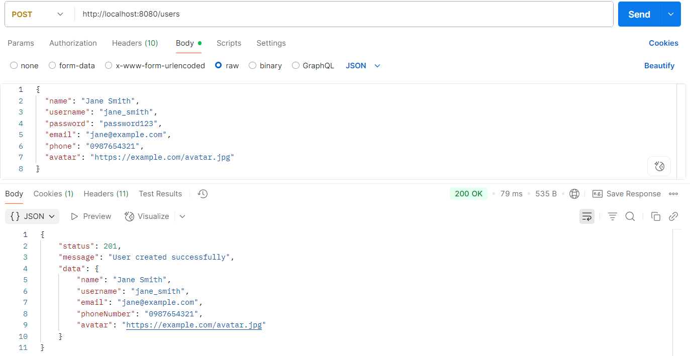

**Response lỗi (400 - Validation Error)**:
```json
{
   "type": "/users",
   "title": "Validation Exception",
   "status": 400,
   "detail": "Validation Failed",
   "instance": "/users",
   "errors": [
      "Username cannot be blank",
      "Name cannot be blank"
   ]
}
```
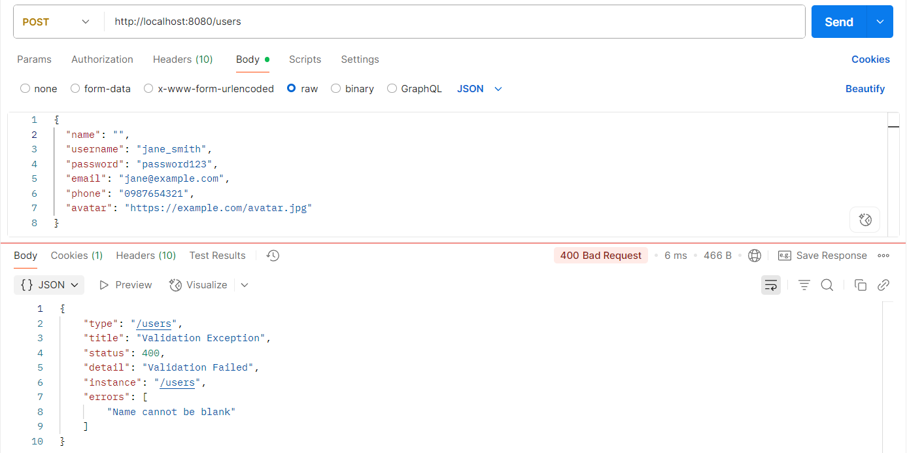

**Response lỗi (409 - Conflict)**:
```json
{
   "type": "/users",
   "title": "Application Exception",
   "status": 400,
   "detail": "User existed",
   "instance": "/users",
   "errors": [
      "User existed"
   ]
}
```
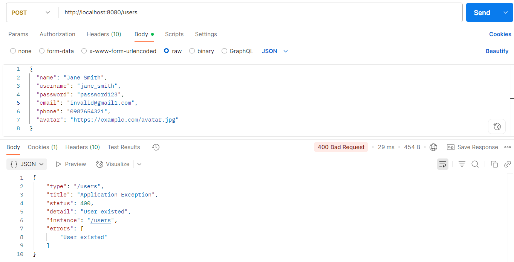

### 6. PUT /users/update - Cập nhật thông tin cá nhân

**Mô tả**: Cập nhật thông tin của user đang đăng nhập

**Headers**:
```
Authorization ->  Auth Type -> Bearer Token -> Token: eyJhbGciOiJIUzI1NiIsInR5cCI6IkpXVCJ9...
```

**Request Body**:
```json
{
   "name": "Nguyễn Văn A",
   "username": "nguyenvana123456",
   "password": "123456",
   "email": "invalid@gmail.com",
   "phone": "0123456789",
   "avatar": "https://example.com/avatar.jpg"
}
```

**Response thành công (201)**:
```json
{
   "status": 201,
   "message": "Update User successfully"
}
```
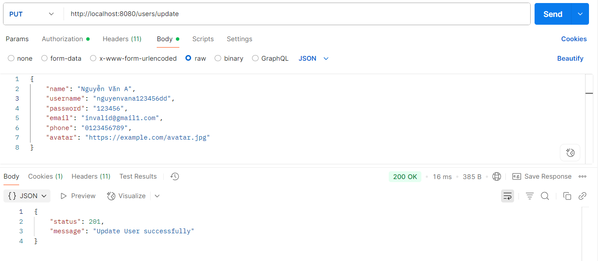
**Response lỗi (400 - Validation Error)**:
```json
{
   "type": "/users/update",
   "title": "Validation Exception",
   "status": 400,
   "detail": "Validation Failed",
   "instance": "/users/update",
   "errors": [
      "email must not blank"
   ]
}
```
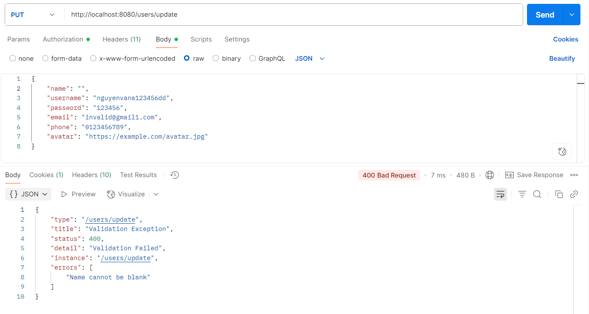
**Response lỗi (401 - Unauthorized)**:
```json
{
  "status": 401
}
```

### 7. DELETE /users/{id} - Xóa user (Admin only)

**Mô tả**: Xóa user theo ID (chỉ ADMIN mới có quyền)

**Headers**:
```
Authorization ->  Auth Type -> Bearer Token -> Token: eyJhbGciOiJIUzI1NiIsInR5cCI6IkpXVCJ9...
```

**Path Parameters**:
- `id` (required): ID của user cần xóa

**Response thành công (201)**:
```json
{
   "status": 201,
   "message": "Delete User successfully"
}
```

**Response lỗi (404 - User not found)**:
```json
{
  "status": 404,
  "message": "User not found",
  "error": "User with ID 123 does not exist"
}
```

**Response lỗi (401 - Unauthorized)**:
```json
{
  "status": 401
 
}
```


## 📞 Liên hệ

- Email: [vuquoclong_t67@hus.edu.vn]
